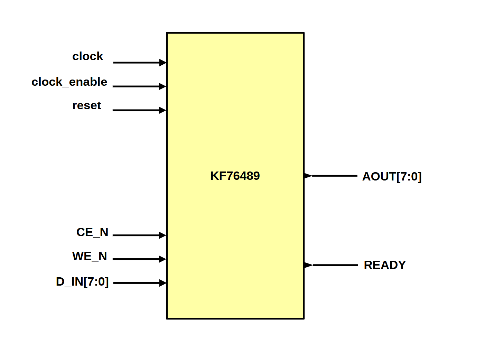

# KF76489 - SN76489-like Digital Complex Sound Generator(DCSG) written in SystemVerilog

## About
KF76489 is Digital Complex Sound Generator(DCSG) like SN76489

## Features
- 3 Programmable tone generators
- Programmable white noise generators
- Programmable attenuation
- Simultaneous sounds

## Block

